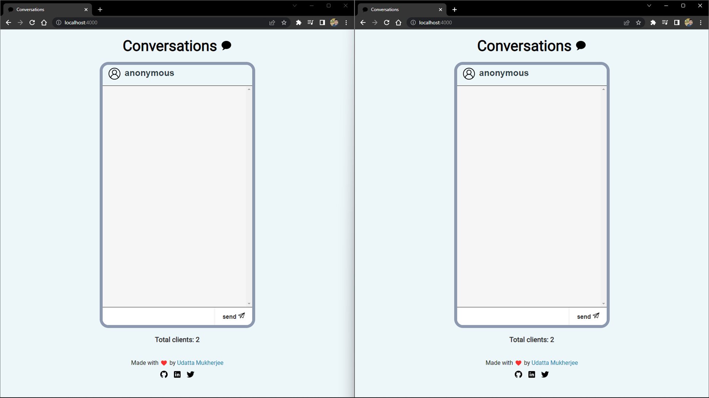
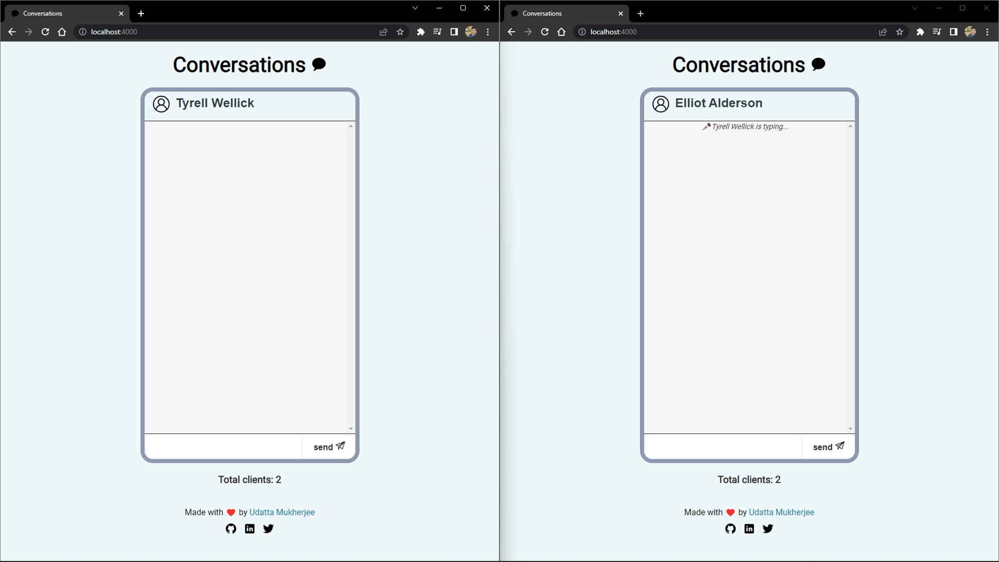
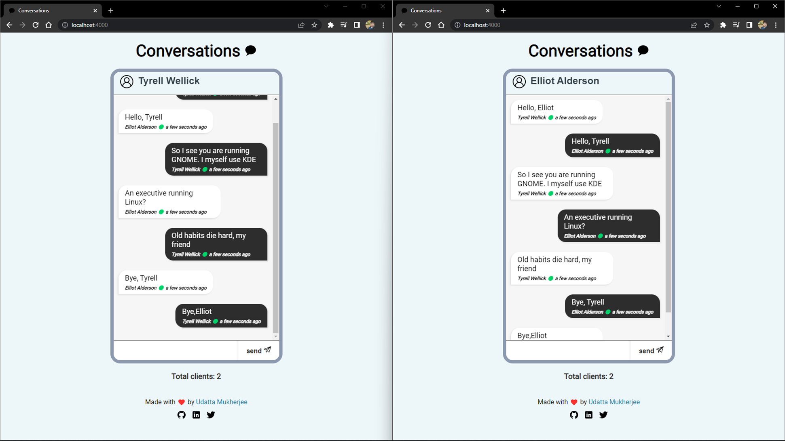

# Conversations

A realtime chat application built with Node.js, Express and Socket.io.

## Table of Contents

- [Overview](#overview)
- [Features](#features)
- [Technologies](#technologies)
- [Setup](#setup)
- [Usage](#usage)
- [Images](#images)
- [Contributing](#contributing)

## Overview

Conversations is a realtime chat application built with Websockets. It is made using Node.js, Express and Socket.io. It allows users to join a chatroom and send messages to other users in the chatroom.

## Features

- Realtime chat
- Typing indicator
- Usernames
- Messages with sender and timestamps information
- Different colors for sender and receiver messages
- Scroll to bottom of chat when new message is sent

## Technologies

- Node.js
- Express
- Socket.io
- HTML
- CSS
- JavaScript
- Google Fonts

## Setup

The structure of the project is as follows:

```
Conversations
├── public
├── app.js
├── package.json
├── package-lock.json
```
First,navigate to the project directory with the following command:

```
cd Conversations
```
To run this project, you will need to have Node.js installed on your computer. You can download it from [here](https://nodejs.org/en/download/). Install the dependencies with the following command:

```
npm install
```
To start the server, run the following command:

```
npm run start
```
If you want to run the server in development mode, run the following command:

```
npm run dev
```
The development mode uses `nodemon` to watch for changes in the code and restart the server automatically.

### Closing Notes
- The entry point of the application is app.js.
- The public folder contains the HTML and CSS files. The package.json file contains the dependencies of the project.
- The app.js file contains the main logic of the application.
- There is a main.js inside the public folder which contains the client side logic of the application.
- With socket.io, we can emit and listen to events. The events are used to send and receive messages. The messages are sent to the server and then broadcasted to all the users in the chatroom.


## Usage

Open multiple tabs in your browser and navigate to `localhost:4000`. Enter your desired username (by default, the username is `anonymous`). Send messages to other users in the chatroom. You can also see the typing indicator when other users are typing. Alternatively, visit [this](https://conversations.onrender.com/) website to try it out!

## Images

**Default Home Page:**

**Typing Indicator:**

**Chatroom:**


## Contributing

Pull requests are welcome. For major changes, please open an issue first to discuss what you would like to change.

---

### Link to the project : [Github Repository](https://github.com/udattam/Conversations)


